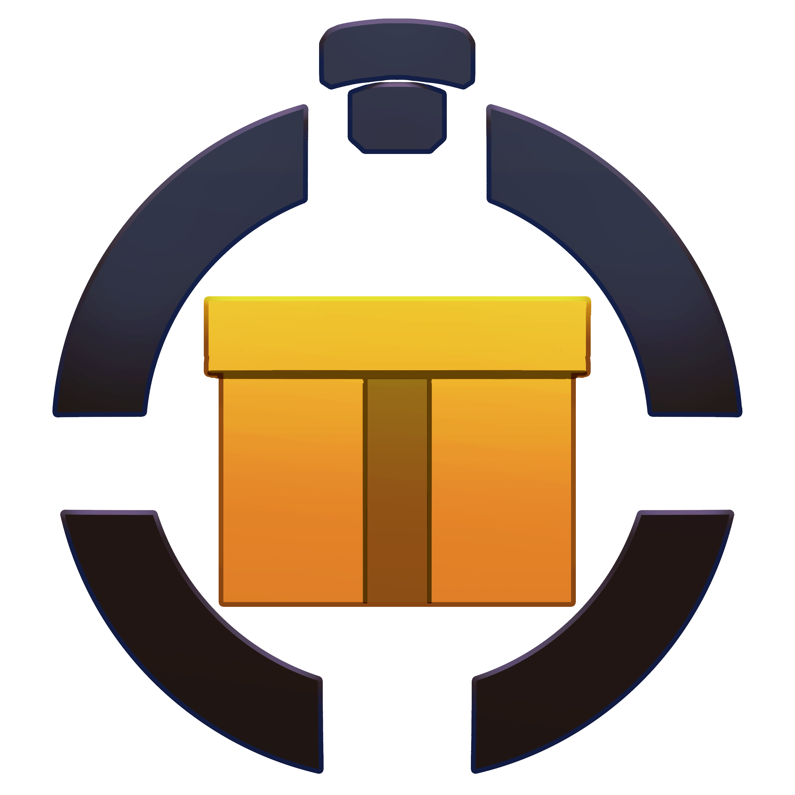

# SubathonManager

 

 
 

  <strong>Subathon Manager</strong> 
  An all-in-one Subathon/Donothon Manager for Twitch and YouTube. Manage your timer,
  goals, overlays, settings, and more - all locally.

 

## [Download Latest](https://github.com/WolfwithSword/SubathonManager/releases/latest)

### [Check the Wiki](https://github.com/WolfwithSword/SubathonManager/wiki)

## Supported Integrations 

 
<strong>Platforms</strong>

 
<strong>Twitch</strong>

- Cheers/Bits (Including Combos & Powerups!)
- Follows, Raids
- Subs, Gift Subs
- Charity Donations
- Chat Commands
- Automations
    - Lock/Pause on Stream End
    - Unlock/Resume on Stream Start
- Hype Trains with optional automated multiplier mode!

 
<strong>YouTube</strong>

- SuperChats
- Memberships (Configurable Levels) & Gift Memberships
- Chat Commands

 
<strong>Picarto</strong>

- Follows
- Subs & Gift Subs
- Kudos Tips
- Chat Commands

 
<strong>Integrations</strong>

 
<strong>GoAffPro Affiliate Stores</strong>

- UwuMarket
- GamerSupps

 
<strong>KoFi</strong>

Requires StreamerBot

- Tips
- Memberships

 
<strong>StreamElements</strong>

- SE Pay Tips

 
<strong>StreamLabs</strong>

- Donations

 
<strong>Blerp</strong>

- Bits & Beets
    - On both YouTube and Twitch

 
<strong>External</strong>

Custom commands, donations and subscriptions via POST API or WebSocket

## Features

- Currency conversions for donations/tips/superchats using daily floating rates
- Points or Donation (Donothon-style) based goals
- Audit & Event logging to file and Discord webhooks
- Built in overlay editor and host server for local html widgets
- Goals list tracking
- Multiplier modes for time and/or points
- External control API for integrating with complex setups and unsupported services
- Reverse Subathon - timer goes up, events reduce time!
- Remote config value management
- And more!

## License

We use a [modified MIT License](LICENSE) that only prohibits the software from being sold or redistributed commercially, or offered as or part of a commercial service.

You are fully permitted to *use* the software for commercial purposes such as streaming, or developing widget assets for sale. Modifications are allowed, provided they retain this license, though contributions back are preferred!

In private, you can do whatever you want. This software is as open-source as possible with that single restriction, as its sole purpose is to prevent users from being taken advantage of from commercial distributions/derivatives of this otherwise open and free software.

## Contact

For questions, issues, or other, you can leave an issue or discussion here in the repo.

Alternatively, you can contact me through Discord.

